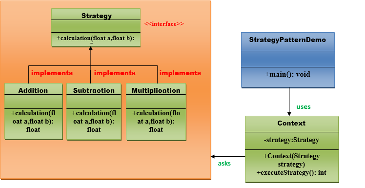

# Core Java Design Patterns Introduction
In core java, there are mainly three types of design patterns, which are further divided into their sub-parts:
## 1.Creative Design Pattern
#### 1.1 Factory Pattern
#### 1.2 Abstract Factory Pattern
#### 1.3 Singleton Pattern
#### 1.4 Prototype Pattern
#### 1.5 Builder Pattern.

## 2.Structural Design Pattern
#### 2.1 Adapter Pattern
#### 2.2 Bridge Pattern
#### 2.3 Composite Pattern
#### 2.4 Decorator Pattern
#### 2.5 Facade Pattern
#### 2.6 Flyweight Pattern
#### 2.7 Proxy Pattern

## 3.Behavioral Design Pattern
#### 3.1 Chain Of Responsibility Pattern
#### 3.2 Command Pattern
#### 3.3 Interpreter Pattern
#### 3.4 Iterator Pattern
#### 3.5 Mediator Pattern
#### 3.6 Memento Pattern
#### 3.7 Observer Pattern
#### 3.8 State Pattern
#### 3.9 Strategy Pattern
> A Strategy Pattern says that "defines a family of functionality, encapsulate each one, and make them interchangeable".
  The Strategy Pattern is also known as Policy.

**Benefits:**  
It provides a substitute to subclassing.  
It defines each behavior within its own class, eliminating the need for conditional statements.  
It makes it easier to extend and incorporate new behavior without changing the application.  

**Usage:**  
When the multiple classes differ only in their behaviors.e.g. Servlet API.  
It is used when you need different variations of an algorithm.  

**UML for Strategy Pattern:**  

#### 3.10 Template Pattern
#### 3.11 Visitor Pattern        