# Core Java Design Patterns Introduction
In core java, there are mainly three types of design patterns, which are further divided into their sub-parts:
## 1.Creative Design Pattern
#### 1.1 Factory Pattern  
>A Factory Pattern or Factory Method Pattern says that just _**define an interface or abstract class for creating an object 
but let the subclasses decide which class to instantiate**_. In other words, subclasses are responsible to create the instance of the class.
The Factory Method Pattern is also known as Virtual Constructor.  

**Benefits:**  
1.Factory Method Pattern allows the sub-classes to choose the type of objects to create.  
2.It promotes the loose-coupling by eliminating the need to bind application-specific classes into the code.
That means the code interacts solely with the resultant interface or abstract class, so that it will work with any
classes that implement that interface or that extends that abstract class.

**Usage:**  
1.When a class does not know what sub-classes will be required to create.  
2.When a class wants that its sub-classes specify the objects to be created.  
3.When the parent classes choose the creation of objects to its sub-classes.  

**UML for Factory Method Pattern:**  
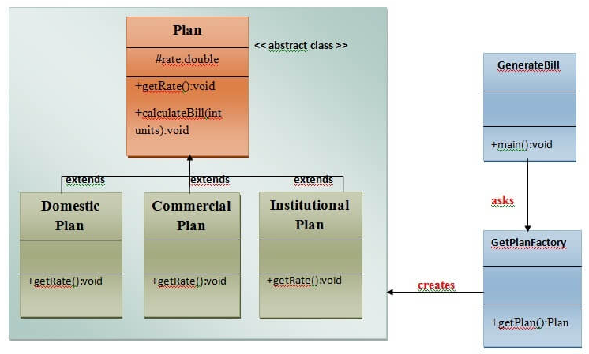

#### 1.2 Abstract Factory Pattern  
>Abstract Factory Pattern says that just define an interface or abstract class for creating families of 
related (or dependent) objects but without specifying their concrete sub-classes.That means Abstract Factory 
lets a class returns a factory of classes. So, this is the reason that Abstract Factory Pattern is one level 
higher than the Factory Pattern. An Abstract Factory Pattern is also known as Kit.

**Benefits**  
1.Abstract Factory Pattern isolates the client code from concrete (implementation) classes.  
2.It eases the exchanging of object families.  
3.It promotes the consistency among objects.

**Usage**  
1.When the system needs to be independent of how its objects are created, composed and represented.  
2.When the family of related objects needs to be used together, then this constraint needs to be enforced.  
3.When you want to provide a library of objects without showing implementation and just reveals the interface.  
4.When the system needs to be configured with one of a multiple family of objects.

**UML for Abstract Factory Pattern**  
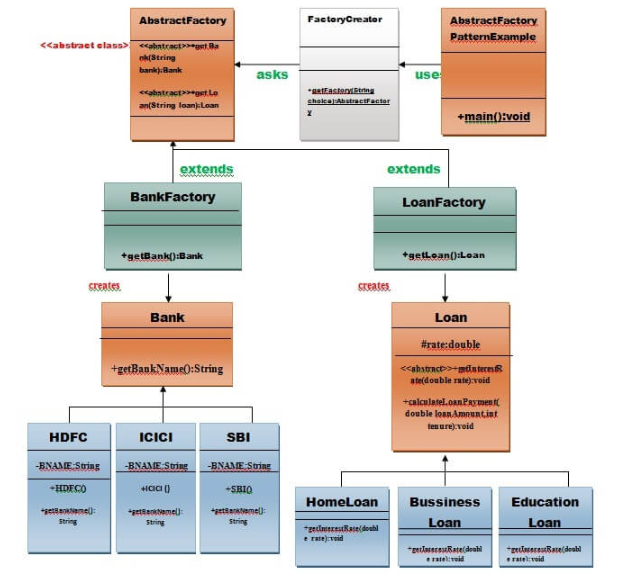

#### 1.3 Singleton Pattern
>Singleton Pattern says that just define a class that has only one instance and provides a global point 
of access to it.There are two types of singleton pattern:
1.Early Instantiation: creation of instance at load time
2.Lazy Instantiation: creation of instance when required

**Benefits:**  
1.Save memory because just create a single object, that object is reused again ans again.

**Usage:**  
1.It is mostly used in multi-threaded and database applications. It is used in logging, caching, thread pools
and configuration settings etc.

**UML of Singleton Pattern:**  
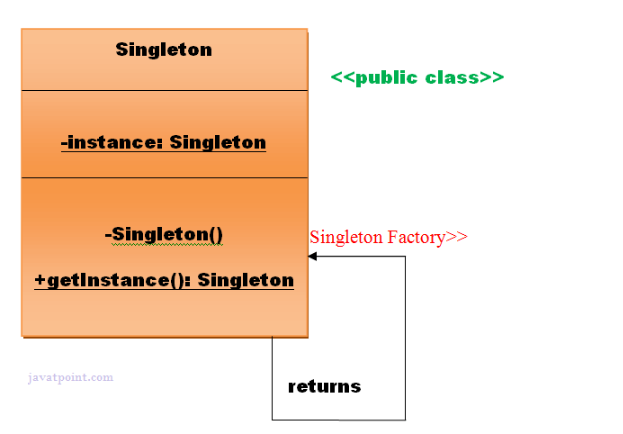
####
**Significance of Serialization in Singleton Class**  
If singleton class is Serializable, you can serialize the singleton instance. Once it is serialized, 
you can deserialize it but it will not return the singleton object.  
To resolve this issue, you need to override the readResolve() method that enforces the singleton. 
It is called just after the object is de-serialized. It returns the singleton object.
```
public class A implements Serializable {  
    //your code of singleton  
    protected Object readResolve() {  
        return getA();  
    }  
  
}
```

#### 1.4 Prototype Pattern
>Prototype Pattern says that cloning of an existing object instead of creating new one and can also be 
customized as per the requirement.

**Benefits:**  
1.It reduces the need of sub-classing.  
2.It hides the complexities of creating object.  
3.The clients can get new objects without knowing which type it will be.  
4.It lets you add or remove objects at runtime.

**Usage:**
1.When the classes are instantiated at runtime.  
2.When the cost of creating an object is expensive or complex.  
3.When you want to keep the number of classes in an application minimum.  
4.When the application needs to be unaware of object creation and representation.

**UML for Prototype Pattern:**  
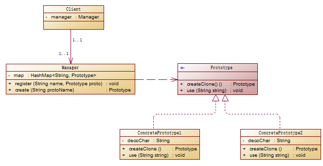

**Why need Prototype Pattern:**  
1.There are many objects that have different formats, if we create class for each format, there will be so many classes.
Such as, in this code sample, we have * and /  MessageBox, = and $ underline, four formats. if we want we can create
as many as formats just using prototype. Bu if we create class for each format, there will be a mess.  
2.Some times we cannot create a complex object just by using new(). For example, you have a button object, after many
actions, it becomes very complex with color, background pic, texts, actions and so on. If we wat a new object as the same
as this button, we cannot do it just use new().  

#### 1.5 Builder Pattern.
>Builder Pattern says "construct a complex object from simple objects using step-by-step approach." So we can
say, if an object is consist of several components, every component is complex, but using components to create 
an object is simple, then we can separate the process of building components and the process of building 
object with components. 

**Sample:**  
If we need to build a computer, we know that a computer consists of master, monitor, keyboard, mouse and so on.
Although the type of every parts may be different, such as one computer has i7cpu master, another computer has 
i5cpu master. But whatever, the process of building a computer is building master, monitor, keyboard, mouse.

**Benefits:**  
1.It provides a clear separation between construction and representation of an object.  
2.It provides better control of construction process.  
3.It supports to change the internal representation of objects.

**UML of Builder Pattern:**  
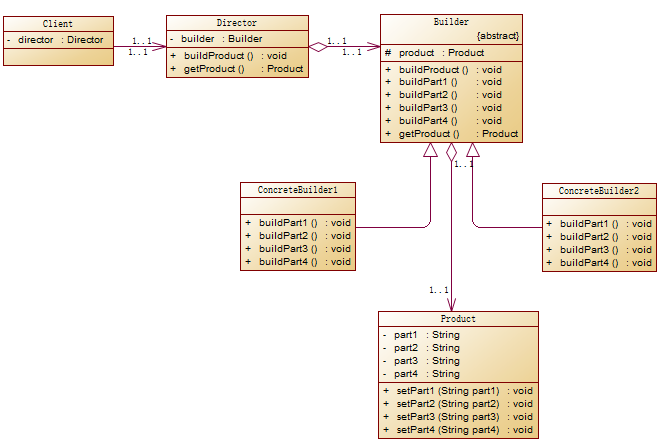

## 2.Structural Design Pattern
#### 2.1 Adapter Pattern
>converts the interface of a class into another interface that a client wants. In other words, to implement
the transform between two interfaces.

**Description:**  
The adapter pattern is very common in real life. Such as the adapter of our mobile phone. My phone is iphone 8,
but i forgot to take the corresponding charger of it. I can use the charger of Android phone if i have a adapter.


**Benefits:**  
1.It allows two or more previously incompatible objects to interact.  
2.It allows reusability of existing functionality.  

**Usage:**  
1.When an object need to utilize an existing class with an incompatible interface.  
2.When you want to create a reusable class that cooperates with classes which don't have compatible interfaces.

**UML of Adapter Pattern:**  
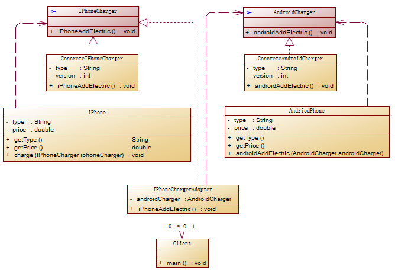

#### 2.2 Bridge Pattern
>decouple the functional abstraction from the implementation so that the two can vary independently.

**Description:**  
The Bridge pattern connects the functional level and the implementation level.  
1.Functional level: For adding new functions. For example, we have a class here, and we want to add new functions
in this class but without changing this class. Then we can create a new class which extends this base class, and 
add new functions in the child class. This is what we say functional level.  
2.Implementation level: For adding new implementations. For example, we have an abstract class or a interface 
which defines many functions without implementation.For specific implementation, we need to extend that abstract class
or implement that interface. This is what we say implementation level.  
3.Bridge pattern is for connecting this two levels.

**Benefits:**  
1.It enables the separation of implementation from interface.  
2.It improves the extensibility.  
3.It allows the hiding of implementation details from client.

**Usage:**  
1.When you don't want a permanent binding between the functional abstraction and its implementation.  
2.When both the functional abstraction and its implementation need to extend using sub-classes.  
3.It is mostly used in those places where changes are made in the implementation does not affect the clients.

**UML of Bridge pattern:**  
An example: To print something. User can choose how many times to print.  
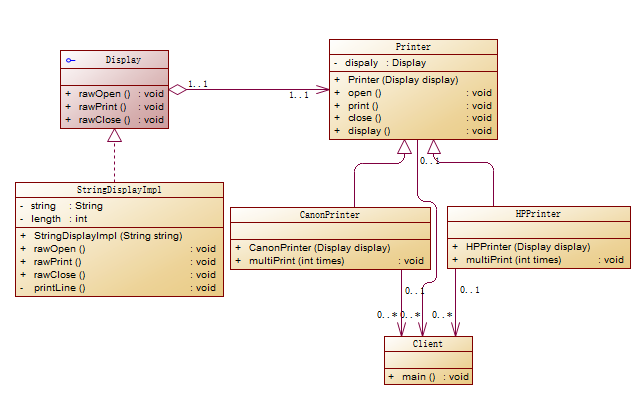

#### 2.3 Composite Pattern
>allow clients to operate in generic manner(通用方式) on objects that may or may not represent a 
hierarchy of objects(对象等级)

**Description:**  
In computer system, we have a concept named folder. A folder can save sub-folders and files, but a file cannot 
save folders or files. That means folder and file consist of a recursive structure and container structure. 

**Benefits:**  
1.It defines class hierarchies that contain primitive and complex objects.(定义了包含原始对象和复杂对象的类层次结构)  
2.It makes easier to you to add new kinds of components.(让你更简单的添加新类型的组件)  
3.It provides flexibility of structure with manageable class or interface.(它通过可管理的类或接口提供结构的灵活性)  

**Usage:**  
1.When you want to represent a full or partial hierarchy of objects.(当你想要表示对象的全部或部分层次机构时)  
2.When the responsibilities are needed to be added dynamically to the individual objects without affecting 
other objects(当需要将职责动态地添加到各个对象中而不影响其他物件时).Where the responsibility of object 
may vary from time to time(对象的职责可能会不时发生变化).

**UML of Composite Pattern:**  
Composite pattern consists of three roles:  
1.File: it's the smallest class which cannot save other components.  
2.Folder: it's the composite class, like a container. It can save other folders and files.  
3.Component: it's a common class of file and folder, defines common attributes and behaviors. Generally, it
is the parent class of File and Folder.  
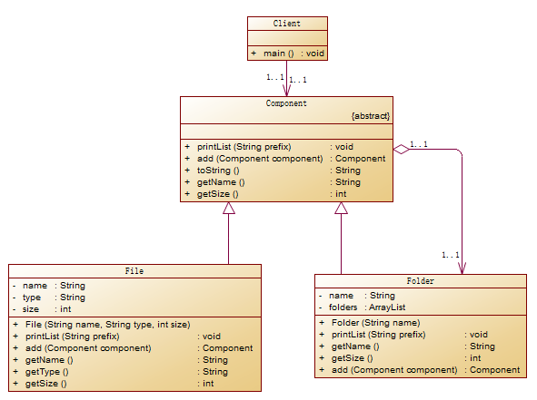

#### 2.4 Decorator Pattern
>A decorator pattern says that just "attach a flexible additional responsibility to an object dynamically."
(给对象动态地添加灵活的附加的职责)

**Description:**  
For example, we have a coffee bar. every beverage has its description and cost. But for each beverage, user may want
to add some condiment(调料), such as: mocha(摩卡), milk(牛奶), soy(豆浆), syrup(糖浆). If we bind every condiment 
with every beverage, the system will become very complex. So we can use condiment as a decorator of beverage.

**Benefits:**  
1.It provides greater flexibility than static inheritance.  
2.It enhances the extensibility of object, because changes are made by coding new classes.  
3.It simplifies the coding by allowing you to develop a series of functionality from targeted classes instead of
coding all of the behavior into the object.  

**Usage:**  
1.When you want to transparently and dynamically add new responsibilities to objects without affecting new objects.  
2.When you want to add new responsibilities to an object that you may want to change in the future.   
3.Extending functionality by sub-classing is no longer practical.(通过子类扩展功能不再可行。)

**UML of decorator pattern:**  
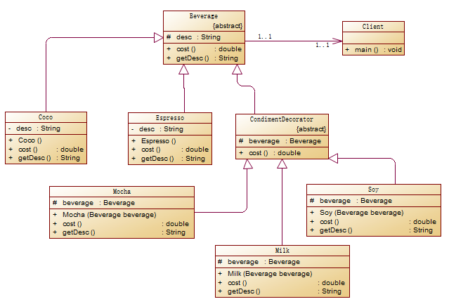

#### 2.5 Facade Pattern
>Facade Pattern says just provide a unified and simplified interface to a set of interfaces in a subsystem,
therefore it hides the complexities of the subsystem from the client.(提供外**部访问内部复杂代码的一个接口).
Practically, every Abstract Factory is a type of Facade.(每个抽象的工厂都是一种外观模式)

**Description:**  
For example, we can open a computer by just clicking on the start button. But behind this button, there are 
many complex actions: memory loads, hard drive reads data, cpu processes data. In this sample, the start button
is a type of facade pattern.

**Benefits:**  
1.It shields the client from the complexities of the sub-system components.  
2.It promotes loose coupling between subsystems and its clients.

**Usages:**  
1.When you want to provide a simple interface for a complex subsystem.  
2.When several dependencies exist between clients and the implementation classes of an abstraction.

**UML of Facade Pattern:**  
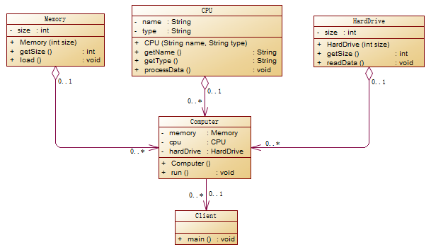

#### 2.6 Flyweight Pattern(享元模式)
>The flyweight pattern says that just to reuse already existing similar kind of objects by storing them 
and create new object when no matching object is found.(flyweight 意思是轻量级，享元模式就是为了使对象更轻)

**Description:**  
When we need a lots of objects, if we use new keyword to create objects, it will waste a lot of memory. 
The flyweight pattern is very similar to singleton pattern. When we need instance, we firstly check if we have
that instance in the memory, if have we directly use it, if no, we create it using new keyword.  
The general format of Flyweight Patter:  
角色：  
Flyweight（抽象享元类）：通常是一个`接口`或者`抽象类`，在抽象享元类中声明了具体享元类公共的方法，这些方法可以向外部
提供享元对象的内部数据（内部状态），同时也可以通过这些方法来设置外部数据（外部状态）。  
ConcreteFlyweight（具体享元类）：它继承了抽象享元类，实例就是享元对象。在具体享元类中为内部状态提供了存储空间。
通常我们通过`单例模式`来设计具体享元类，为每一个享元类提供`唯一的享元对象`。  
UnsharedConcreteFlyweight（非共享具体享元类）：并不是所有抽象享元类的子类都需要被共享，不能被共享的子类可以设计为
非共享的享元类，当需要非共享的享元对象时，可以用`new关键字创建`。  
FlyweightFactory（享元工厂类）：享元工厂类用于创建并管理享元对象。将各种类型的享元对象放在一个`享元池`中，
一般是一个HashMap，可以结合工厂模式进行设计。当用户请求一个具体的享元对象时，享元工厂检查享元池中是否已经有这个对象，
有的话直接取出使用，没有的话创建一个新的实例，并把新实例存储在享元池中。  

**Benefits:**  
1.It reduces the numbers of objects.  
2.It reduces the amount of memory and storage devices required if the objects are persisted.

**Usages:**  
1.When an application uses number of objects.  
2.When the storage cost is high because of the quantity of objects.  
3.When the application does not depend on object identity.(当应用程序不依赖于对象标识时)

**UML of Flyweight Pattern:**  
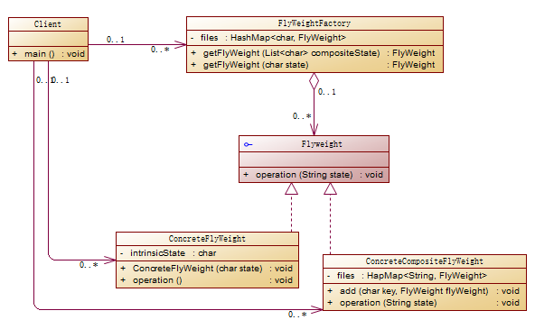

#### 2.7 Proxy Pattern
>Simply, Proxy Pattern means an object representing another object. It provides the control for accessing 
original object.

**Description:**  
Proxy Pattern is just like an agent. It helps real object do some pre or post tasks. For example, you need to
buy a house, then you get an agent to deal with the details things with the seller, you just need to provide
your identify card, money and so on...
代理模式中的角色：

Subject（主体）
Subject角色定义了使proxy和realSubject角色之间具有一致性的接口。这个接口提供了一个使用的好处，就是client不必却分它使用的是代理对象还是真实对象。
对应实例中Buyer角色

Proxy（代理人）
Proxy角色会尽量处理来自Client角色的请求。只有当自己不能处理的时候，就交给工作交给真实对象。代理对象只有在有必要时才会生成真实的对象。
实例中对应的是AgentProxy对象。

RealSubject(真实对象)
就是实际完成工作的对象，对应实例中的You对象。

**Benefits:**  
1.It provides the protection to the original object from the outside world.

**UML of Proxy Pattern:**  
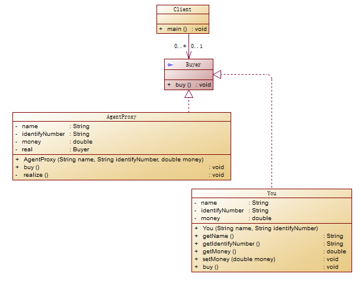

## 3.Behavioral Design Pattern
#### 3.1 Chain Of Responsibility Pattern
>In chain of responsibility pattern, sender sends a request to a chain of objects. The request can be handled 
by any object in the chain.

**Description:**  
The principle if chain of responsibility pattern is giving the task to other object. There is a group of objects
to handle request, if current object can not deal with the request, it will send the request to next object.
The if-else is a type of chain of responsibility pattern.

**Benefits:**  
1.It reduces the coupling.  
2.It adds flexibility while assigning the responsibilities to objects.  
3.It allows a set of classes to act as one; events produced in one class can be sent to other classes 
with the help of composition.  

**Usages:**  
1.When more than one object can handle a request and the handler is unknown.  
2.When the group of objects that can handle the request must be specified in dynamic way.  

**UML of Chain of Responsibility Pattern:**  
For example, if a employee want to take leave, he needs to request to his mentor, if the leave days is less than
3 days, his mentor can approve, if the leave days is greater than 3 days but less than 7 days, after his mentor
approves also need a manager approves, if the leave days is greater than 7 days, need the CEO to approve.  
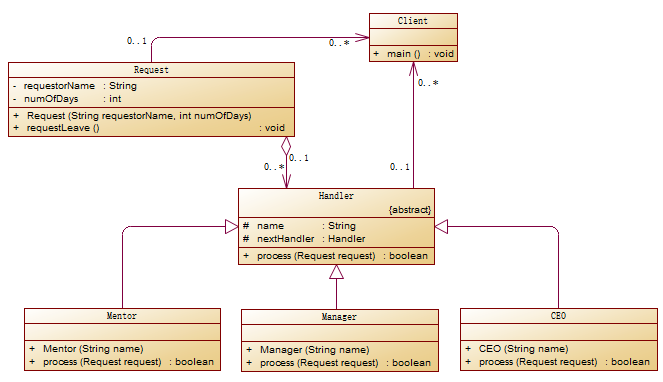
  
#### 3.2 Command Pattern
#### 3.3 Interpreter Pattern
#### 3.4 Iterator Pattern
#### 3.5 Mediator Pattern
#### 3.6 Memento Pattern
#### 3.7 Observer Pattern
#### 3.8 State Pattern
#### 3.9 Strategy Pattern
> A Strategy Pattern says that "defines a family of behaviors, encapsulate each one, and make them interchangeable".
It enables an algorithm's behavior to be selected **`at runtime`**.The Strategy Pattern is also known as Policy.

**Benefits:**  
1.It provides a substitute to subclassing.  
2.It defines each behavior within its own class, eliminating the need for conditional statements.  
3.It makes it easier to extend and incorporate new behavior without changing the application.  

**Usage:**  
1.When the multiple classes differ only in their behaviors.e.g. Servlet API.  
2.It is used when you need different variations of an algorithm.  

**UML for Strategy Pattern:**  
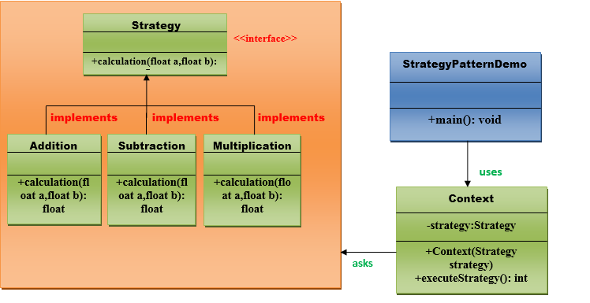

#### 3.10 Template Pattern
#### 3.11 Visitor Pattern        