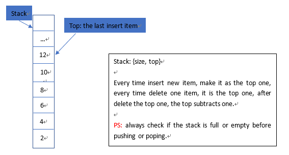
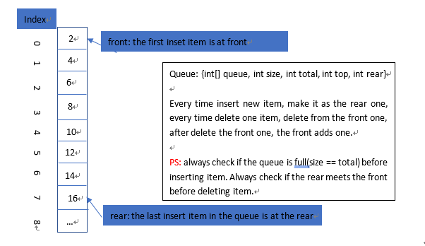
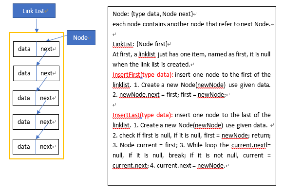
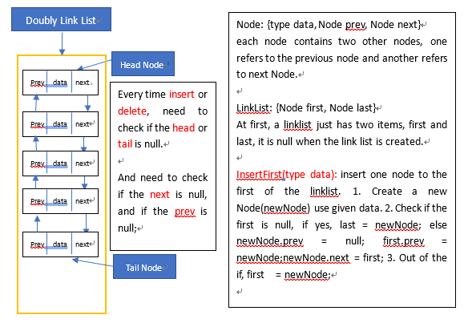
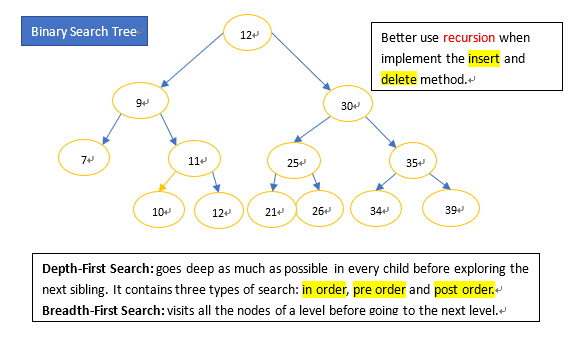
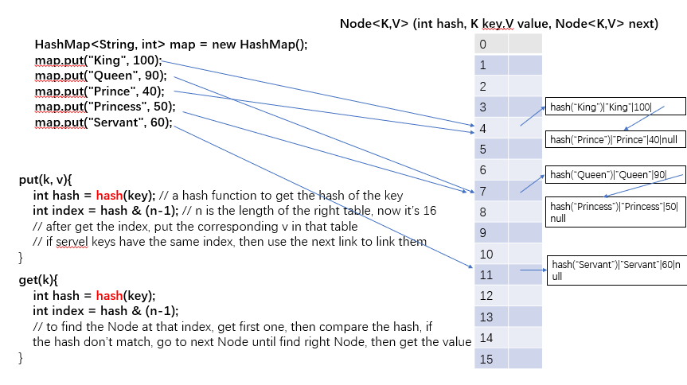

# Learn about how to storage data in computer
In order to learn data structure, we need to know something about storing data in our computer.  
**1. Memory:** it's also called RAM, it saves some temporary data, and when your program attends to find data, it firstly 
search the memory.  
**2. Storage:** it's some places that can save persistent data, such as your disks in you computer, and the hard drive...
every time you restart your computer, the data saved in the disks is still there, but the data in memory is lost.  
**3. Data type:** all data(int, float, string...) stored in our memory are in the type of **'Binary'**,
that means 1 or 0, each 1 or each 0 is called **a bit** in computer.We all know that int is a 32-bit type data.  
>The Memory of computer actually is a long tape of bytes. and a byte = 8 bits

So you can think that an int number in memory took 4 bytes position, and each byte has a address in the memory

# Array
An array is a constant address in memory to save a fixed numbers data.
```
int a = 3;
int[] sampleArray = {0, 1, 2, 3}; // this will take constant 32 bytes in memory
int b = 10;
```
You cannot add two other elements to sampleArray, because at that address there is no available address for new elements.  
If you still want to add new elements, you need to create a new array has longer length, and copy the data in the first array,
then paste into new array, then add elements to new array, then delete the old array.

# Stack
**Last in First Out:** think of the plates in a box, the first one you can take is the last one you put in.  
>

# Queue
**First in First Out:** think of when you in a queue for paying in a market, the first people join the queue will
first pay and leave.
>


# Linked List
**List of Objects:** each item of the list is a Object containing at least two variables, one is the value,
another is the address of next Object.
>

> **The Doubly Link List:**  


# Binary Search Tree: 
**one node at most has two children. when insert node to this tree, the node less than or equal to parent should be in the left sub-tree, 
greater than parent should be int the right sub-tree of parent.**


# HashMap: 
**hash map uses an array to save the info(an object) of each key-value pairs. generally, each item of that array is an object,
such as Node, contains the hash value of the key, the key, and the value, and the next Node.
the hash value of the key decides the index of that Node in the array. Because some keys may have the same hash value,
so each Node should have a Node variable to link the next Node that has the same index**
